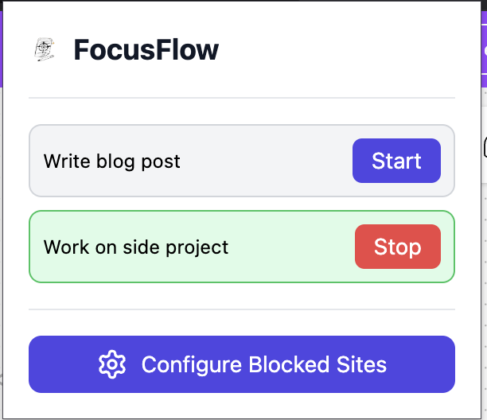
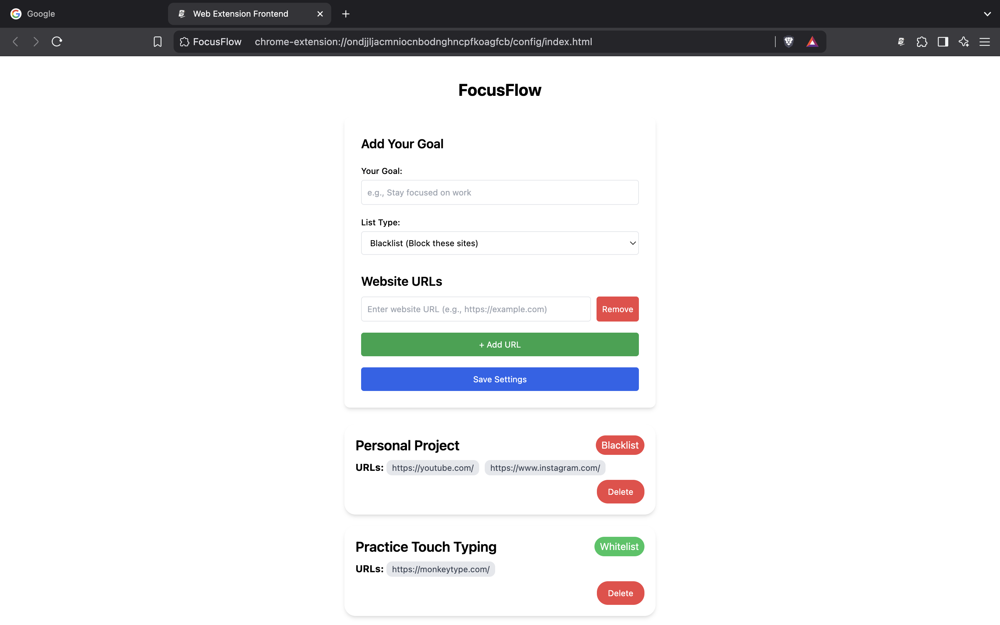
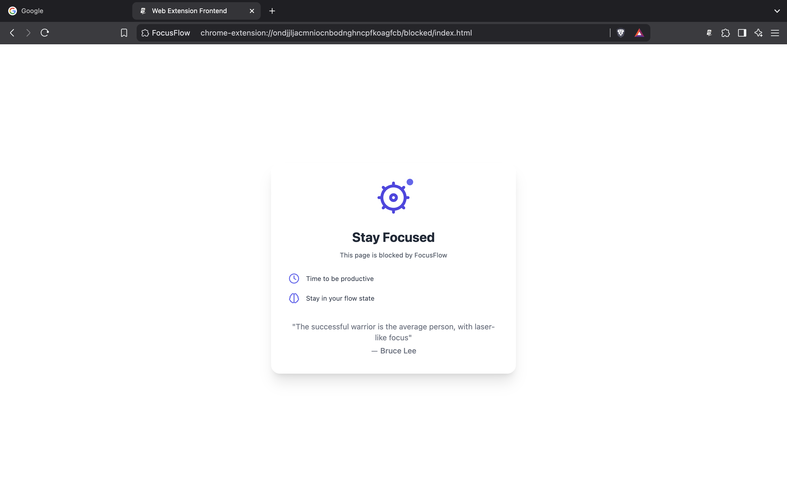

## **FocusFlow: Stay Focused, Boost Productivity**



### **What It Does**

FocusFlow is a powerful browser extension designed to help you maintain focus and increase productivity by managing your web browsing habits. With two key features, FocusFlow empowers you to stay on track:



#### **1. Website Blocking Strategies**

- **Blacklist Mode**: Block specific websites that distract you from your goals.
- **Whitelist Mode**: Allow access only to selected websites, limiting your browsing to essential resources.

#### **2. Goal-Oriented Blocking**

- Create personalized goals with associated URL restrictions.
- Dynamically manage which websites you can or cannot access.
- Redirect to a motivational "blocked" page when attempting to visit restricted sites.



---

## **Contributors Guide**

### **Prerequisites**

- Node.js (v16 or higher)
- npm or yarn
- Basic understanding of React, TypeScript, and Chrome Extension development

### **Setup**

#### **1. Clone the Repository**

```bash
git clone <repo name>
cd focusflow
```

#### **2. Install Dependencies**

```bash
npm install
# or
yarn install
```

#### **3. Build The Files**

```bash
# Start development server
npm run build
```

#### **4. Install the Extension**

1. Open Chrome.
2. Go to `chrome://extensions/`.
3. Enable **Developer Mode**.
4. Click on **Load Unpacked**.
5. Navigate to the `dist` folder and select it.

---

## **Project Structure**

```
focusflow/
│── popup/          # Popup UI when clicking the extension icon
│── config/         # Configuration pages for managing goals
│── blocked/        # Blocked page template
│── db/             # IndexedDB management
│── backgroundService/ # Chrome extension background scripts
│── manifest.json   # Chrome Extension manifest
```

---

## **Contribution Guidelines**

1. **Fork the repository**
2. **Create a feature branch**
   ```bash
   git checkout -b feature/AmazingFeature
   ```
3. **Commit your changes**
   ```bash
   git commit -m "Add some AmazingFeature"
   ```
4. **Push to the branch**
   ```bash
   git push origin feature/AmazingFeature
   ```
5. **Open a Pull Request**

---

## **Testing**

- Automated testing is yet to be implemented.
- Contributions for test automation are welcome.

---

## **Reporting Issues**

- Use **GitHub Issues**.
- Provide a **detailed description** of the issue.
- Include **steps to reproduce**.
- Attach **screenshots** if possible.
